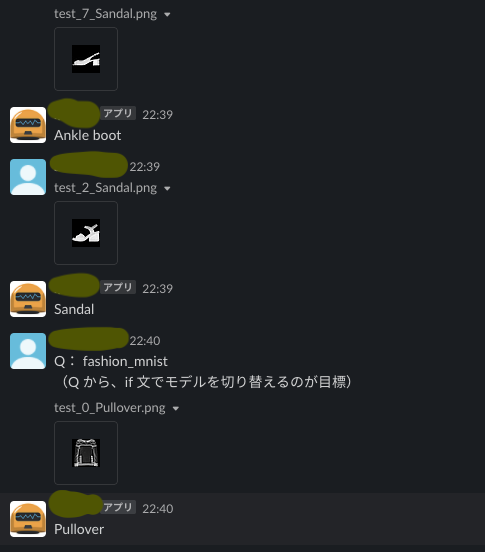

# slackbot ML Model tester
- Slackbot に、機械学習／DeepLearning モデルを、
  - 簡単に
  - 素早く
  
  接続するためのフレームワーク。
- 参考資料
  - [SlackbotをPythonで作成しよう](https://miyabikno-jobs.com/entrance-labotlatori/ )


## Install
### Slackbot
1. SlackのAPIトークンの取得して、.emv ファイルに保存する。
    ```
    cd start_slackbot
    echo BOT_API_TOKEN = "【SlackのAPIトークン】" > .env
    ```

2. Slackbotライブラリをインストールする。  
    ``
    pip install  -r requirements.txt
    ``

3. bot.pyを実行してBotを起動します。
    ```
    python bot.py
    ```
    - 実行すると、Slack上でbotが起動するはず。
    - systemd などで自動起動がオススメ。


### 実装済み モデル
1. fashion_mnist (keras 画像分類チュートリアルモデル)
    1. 学習
        ```
        cd ./start_slackbot/botmodules/fashion_mnist
        pip install  -r requirements.txt
        python train.py 
        ```
    2. テストデータを用意
        ```
        cd ../../
        python botmodules/fashion_mnist/predict.py
        ```
        - `botmodules/fashion_mnist/test_imgs/` に10枚ほど、
            テスト用の画像が生成されているはず。
    3. Slackbot を起動
        ```
        python bot.py
        ```
    4. slack で、bot に画像を送りつける！
        - 

1. 対話モデル


### モデルの追加方法
- （未）
- ユーザーが用意するもの
  - **`predict.py`**
    - args
      - X : str（画像（ファイルのパス）や文章）
      - Q : str（指示、命令、タスク、条件...文）
  -  **`$ python3 predict.py Q X`** が動く環境（dockerコンテナ）
      1. （predict.py が動かせる コンテナを作る）Dockerfile
      1. docker-compose
      - 仕様
        - 以下のコマンドで実行されます。
            ```
            $ docker exec 【model-コンテナ名】  'python3 predict.py  Q  X_path'
            ```
        - [ ] ビルドするためのスクリプト書く？

- idea
  - docker で分離するかも？
    - tensorflow や pytorch などの、ライブラリのバージョン衝突問題があるため。
    - 画像は、Slack 側から URL の形でもらえる。
      - 同じサーバー内なら、docker-compose の volume に落として共有する？
  - docker で、request を受け取ると、
    `$ python3 predict.py X Q`
    を実行する機能を作る？
    - I： docker exec 【model-コンテナ名】  'python3 predict.py  Q  X_path
      - URL の port 番号で、dokcerコンテナを識別する。
      - docker （シェル）のレベルで、python のバージョン問題もあるので、
        - `$ docker exec 【model-コンテナ名】  'python3 predict.py  Q  X_path'`
    - O： model.predict(X)
      - HTTP request() の response として、bot に送る。
    - システム イメージ
  - XQA
    - X： 文、画像　→　./tmpX/
    - Q： 文　→　./tmpX/Q.json

